项目地址: http://101.43.227.123

gitee 地址: https://gitee.com/liuyuanbobo/gulishangcheng


# day01

### 介绍项目

商城模块：首页、商品列表页、商品详情页、加入购物车页面、提交订单页面、支付页面、个人中心查看订单、登录注册

技术栈：vue全家桶(vuex、vuerouter)、axios、webpack


### 创建项目

使用 vue-cli 构建项目

`vue create 项目名称`


#### 目录介绍

package-lock.json 这个文件是package.json中的依赖包依赖其他的包的一些信息,这个文件是可以删除的,下次 npm install 的时候,会自动的生成出来

public 文件夹下的内容,不会被webpack处理,打包的时候直接打包到dist目录下
scr/assets 文件夹 会被webpack处理

vue.config.js -> 脚手架4版本是没有的,5版本有了
jsconfig.json -> 脚手架4版本是没有的,5版本有了

#### ESLint 语法校验

在 vue.config.js 文件中配置

```js
module.exports = {
    lintOnSave: false,
}
```

#### 配置@别名

在 jsconfig.json 中配置

```js
{
  "compilerOptions": {
    "baseUrl": "./",
    "paths": {
        "@/*": ["src/*"]
    }
  },
  "exclude": ["node_modules", "dist"]
}
```


### git 基本操作

创建项目上传 gitee ，步骤：

1. 创建本地仓库

   `git init` 创建本地仓库即可

   > 创建好之后想要推送代码到远端仓库，必须先 commit 一次，否则推不上去

2. 创建远程仓库

   在 gitee 上创建一个[空的]仓库

3. 将远程仓库关联到本地

   

> 遇到的问题:
>
> 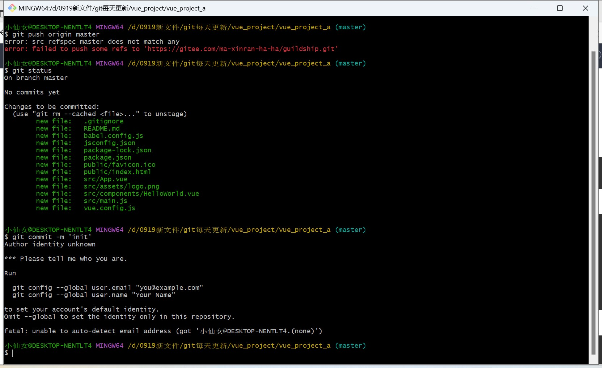
>
> 根据提示执行全局设置（设置用户名和邮箱）:
>
> ```js
> git config --global user.name "xxx"
> git config --global user.email "xxxx@qq.com"
> ```
>
> 如果没有这个设置，证明你之前设置过，这个设置往往在第一次安装git的时候会设置
>
> ---
>
> 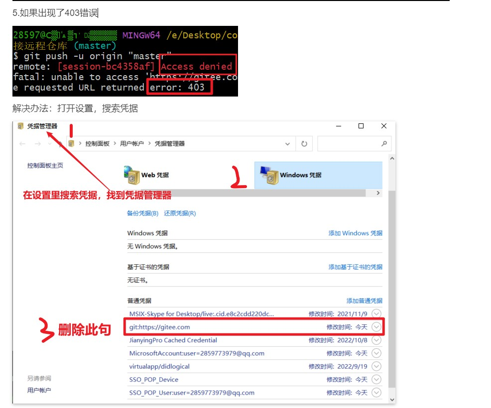
>
> 这是因为本机存储的"git凭证"(用户名和密码) 和 想要推送的远端的 git 账号不是同一个造成的，把本地之前存的用户名密码删掉，再次推送代码，重新输入正确的用户名密码
>
> ---
>
> 当把项目推送到远端之后，需要设置成开源，设置成开源的意义在于别人也可以访问当前你创建的项目


如果是开发者，直接拉取项目代码进行开发即可 `git clone xxxx`


#### git 查看历史提交记录


#### git基本操作

`git init` 初始化一个仓库,会生成一个隐藏文件.git

`git add .` 将现在工作区里面的搜友文件添加到暂存区, 也可以用`git add -A`

`git commit -m '信息'` 将暂存区的内容添加到本地仓库，此时生成一个commit 节点，每次commit都会生成一个提交的节点,用来记录你提交的历史信息

> 当发现提交信息错误的时候,可以立马使用 `git commit --amend` 修改提交信息(注意: 这是在没有推送之前)
>
> 执行这个指令会进入vim编辑器
>
> vim编辑器三种模式: 底行模式、命令行模式(不管)、输入模式
>
> 1. 按 i 变成输入模式，就可以改里面的内容了
>
> 2. 按 esc 输入冒号进入底行模式
>
>    
>
>    :wq    保存并退出
>
>    :w       保存
>
>    :q        退出
>
>    :q!       强制退出(不会保存)

`git push origin 分支名` 这里`git push`是推送的意思,`origin` 是远端地址的别名，可以通过 `git remote` 查看

`git pull origin 分支名` 拉取远端某一个分支的代码

---

git checkout .  将[修改]的文件回退到初始状态

在工作中，不可能只有你一个人在写项目，一定是分工合作，那么涉及到代码的合并(分支合并)

`git checkout -b 分支名` 创建并切换分支

`git branch` 查看当前的分支列表

`git branch 分支名` 创建分支

`git branch -D 分支名` 删除分支

 `git checkout 分支名` 切换分支

`git merge 分支名` 合并分支***


提交和合并分支

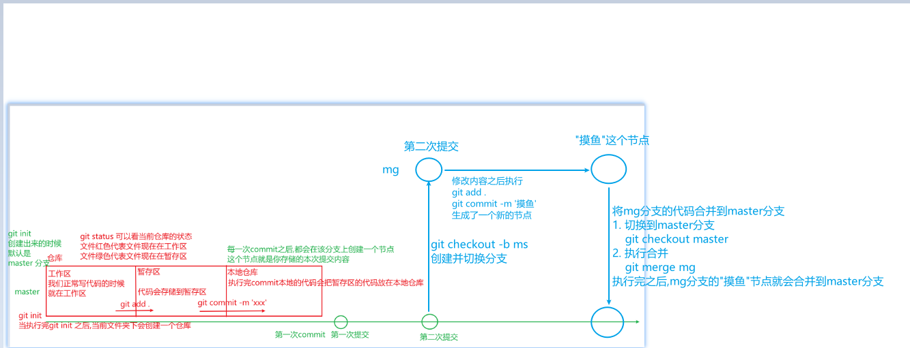


合并分支需要生成一个新节点

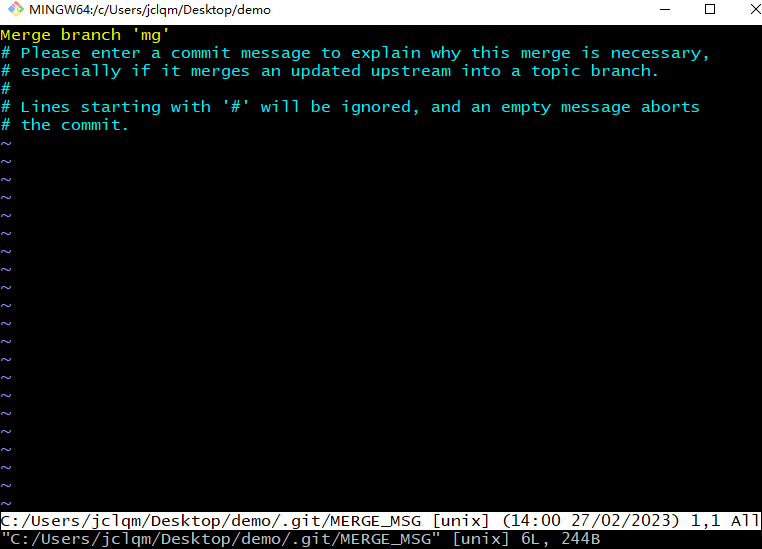


代码产生冲突需要手动解决

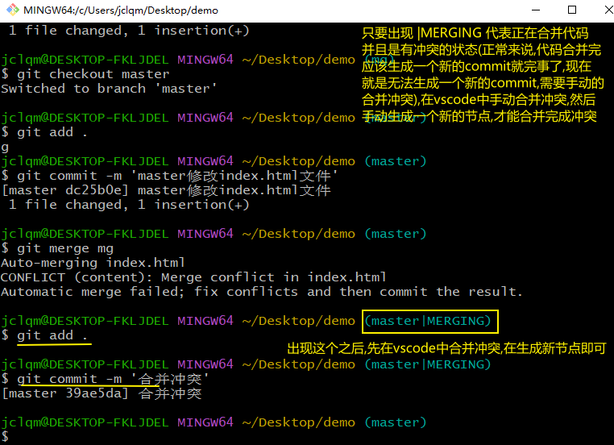


本地合并代码4中情况

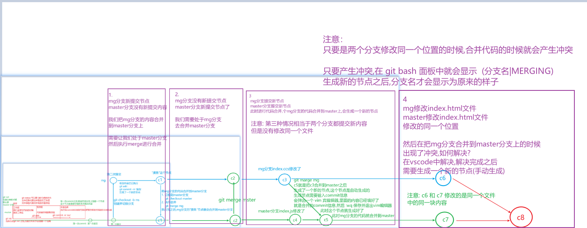


* 自己本地的操作

  git add .

  git commit -m '信息'

* 和远端相关的操作

  git pull origin master

  git push origin master

* 合并分支的操作

  * 自己本地合并

    切换到主分支，使用 `git merge 分支` 来合并分支，合并的时候有冲突解决冲突合并，没有冲突会生成一个新的节点(会弹出一个vim编辑器的框让输入合并信息内容)

  * 远端合并(公司中往往使用这种方式合并)

    将自己的分支推送到远端，提出一个 `pull requests` 请求(合并请求)，等待管理员的审批

    > 注意: 往往这种情况下有冲突管理员是不会给你合并的，需要自己解决完冲突再次发起`pull requests`请求

* 配置 ssh 公钥

  gitee 文档: https://gitee.com/help/articles/4181#article-header0 (个人设置中可以配置)

  (配置ssh公钥是为了免密推送和拉取)

  1. 去 gitee 个人设置中找到配置 ssh 的页面

  2. 按照提示一步步配置公钥

     `ssh-keygen -t ed25519 -C "xxxxx@xxxxx.com" ` （配置公钥的时候一路回车）

     > windows用户配置出公钥的位置 `C:\Users\用户名\.ssh`，会生成两个文件，一个私钥文件（不需要动）一个`.pub`的公钥文件

  3. 打开.pub公钥文件把内容复制到 gitee 的ssh设置页面保存即可

  此时就可以使用 ssh 进行代码的拉取和推送


# day02


### Home组件拆分

观察页面确定页面主体框架，我们的功能页面是 上中下结构。上和下是不变化的，只有中间在变化。

切换页面的时候，页面是不刷新的，证明切换的过程当中请求采用的是ajax请求。

这个是单页面应用，中间的部分就是我们的路由组件切换，上和下，我们全部都定义为非路由组件


#### Header、Footer组件拆分

* 定义

  非路由组件，定义在components当中

  需要拆html、css、图片(注意存放位置)

  css使用的是less、需要单独处理

   ```js
  <style lang="less"></style>
  
  需要安装less,注意: less-loader7版本和less最新版本适配
  npm i less less-loader@7
   ```

* 注册

  在App组件注册

* 使用

  在App组件使用


#### 拆分Home、Search、Login、Register

* 定义

  在pages文件夹(views文件夹)下定义

* 注册

  路由组件注册，在路由中注册

  ```js
  1. 安装路由
  npm i vue-router@3
  2. 引入使用
  import Vue from 'vue'
  import VueRouter from 'vue-router'
  Vue.use(VueRouter)
  
  3. 创建并暴露
  export default new VueRouter({
      // 在routes中注册路由组件
      routes: [
          {
              path: '/home',
              componet: Home // Home组件需要引入
          },
          ...
          {
              path: '/',
              redirect: '/home'
          }
      ]
  })
  
  4. 在创建vm的时候关联router(在main.js中操作)
  ```

* 使用

  在Header组件中设置点击(声明式导航 - Home、Login、Register，编程式导航 - Search)

  在App组件中使用 router-view 展示页面


#### Footer组件 - Login、Register隐藏

从route当中可以获取到path判断可以解决但是麻烦

```html
<Footer v-if=" $route.path != '/login' && $route.path != '/register' "></Footer>
```

通过路由配置的时候路由对象当中配置meta设置来做

```html
<Footer v-if=" !$route.meta.isHidden "></Footer>
```


#### 路由传参相关

* 跳转路由的2种基本方式

  声明式: `<router-link to="">`
  编程式: `this.$router.push()/replace()`
  编程式导航比声明式导航，更加灵活（内部可以加入自己的逻辑），某些情况效率会更好

* 跳转路由携带参数的2种方式

  * params参数属于路径的一部分，匹配的时候路由的path当中要照顾到这个参数，需要在路由配置path中使用 `:xxx` 占位

  * query参数不属于路径的一部分, `?key=value&key=value` 匹配的时候，路由的path不需要照顾到这个参数

  无论是params还是query参数，最终匹配完成都会解析到当前这个路由对象当中params和query属性当中

  显示路由组件的时候，会把当前这个路由对象，传递给组件当中的this.$route，所以this.$route就可以获取到之前传递的参数 `this.$route.params.xxx` `this.$route.query.yyy`

* 路由组件能不能传递props数据?

  可以: 可以将query或且params参数映射/转换成props传递给路由组件对象

  实现: 在路由中配置即可

  1. 布尔值
     `props: true` 只能映射 params 参数

  2. 对象

     ```js
     props: {
         text: 'xxx'
     }
     ```

     用来映射额外的参数

  3. 函数

     ```js
     props: (route) => ({ keyword1:route.params.keyword, keyword2: route.query.keyword })
     ```

     可以映射 params 参数和 query 参数，还有额外的参数

* 指定 params 参数时可不可以用path和params配置的组合?（对象写法）

  不可以用 path 和 params 配置的组合, 只能用 name 和 params 配置的组合
  query 配置可以与 path 或 name 进行组合使用

* 如何指定params参数可传可不传?

  `path: '/search/:keyword?'`

* 如果指定 name 与 params 配置, 但params中数据是一个"", 无法跳转，路径会出问题

  解决1: 不指定params
  解决2: 指定params参数值为undefined

* 描述: 编程式路由跳转到当前路由(参数不变), 多次执行会抛出NavigationDuplicated的警告错误

  原因: vue-router3.1.0之后, 引入了promise的语法
  如果没有通过参数指定成功或者失败回调函数就返回一个promise且内部会判断如果要跳转的路径和参数都没有变化,当没有变化的时候会抛出一个失败的promise进行错误提示

  解决:

  1. 在跳转时指定成功或失败的回调函数, 或者catch处理错误
     这个解决办法不好，因为不能一劳永逸，后期如果用到了push / replace 还要继续都得写

  2. 修改Vue原型上的push和replace方法

     ```js
     const originPush = VueRouter.prototype.push;
     VueRouter.prototype.push = function (location) {
         return originPush.call(this, location).catch(err => err);
     }
     const originReplace = VueRouter.prototype.replace;
     VueRouter.prototype.replace = function (location) {
         return originReplace.call(this, location).catch(err => err);
     }
     ```


#### 拆分首页组件

TypeNav、ListContainer、Like ...... Floor，Brand - 拆html、css(less)、图片


### TypeNav 拿真实数据

#### 使用 postman 测试接口 - postman的使用


#### 发请求 - axios二次封装

要满足的条件:

1. 配置基础路径和超时限制

2. 添加进度条信息  nprogress

3. 返回的响应不再需要从data属性当中拿数据，而是响应就是我们要的数据

4. 统一处理请求错误, 具体请求也可以选择处理或不处理

```js
安装 npm i axios


创建 utils/request.js文件
import axios from 'axios'

const request = axios.create({
    baseUrl: '/api',
    timeout: 20000
})

// 请求拦截器
request.interceptors.request.use((config) => {
    return config
}, (err) => {})

// 响应拦截器
request.interceptors.response.use((response) => {
    return response.data
}, (err) => {})

export default request;
```

#### 封装api文件

```js
// 所有api请求函数都写在这个文件中,方便维护
import request from "@/utils/request";

export const reqCategoryList = () => {
    return request.get('/product/getBaseCategoryList')
}
```


数据放哪 ? 数据放到 store

#### vuex 使用

```js
1. 安装
npm i vuex@3

2. 引入使用
import Vue from 'vue'
import Vuex from 'vuex'
Vue.use(Vuex)

import home from './modules/home.js'

3. 创建并暴露
export default new Vuex.Store({
    // 模块化
    modules: {
        home
    }
})

4. 创建vm的时候进行关联(main.js中操作)
```

模块化 home.js 文件

```js
import { reqCategoryList } from '@/api'

const state = {
    categoryList: [], // 三级分类数据
}

const mutations = {
    SET_CATEGORYLIST(state, categoryList) {
        state.categoryList = categoryList;
    }
}

const actions = {
    async getCategoryList({ commit }) {
        // let result = await request.get('/product/getBaseCategoryList')
        let result = await reqCategoryList();
        // result.code 这个code值是后端定义的,不是HTTP状态码
        // 后端定义 code 值为200代表成功
        if (result && result.code == 200) {
            commit('SET_CATEGORYLIST', result.data)
        } else {
            // 如果后端返回的code值不是200证明请求是成功的,只是参数有问题
            alert('获取三级分类数据失败');
        }
    }
}

const getters = {}

export default {
    state,
    mutations,
    actions,
    getters,
}
```


#### 解决请求跨域 - 测试了请求,发现跨域

配置webpack-dev-server，在vue.config.js文件中

```js
devServe: {
    proxy: {
        '/api': {
            target: 'http://gmall-h5-api.atguigu.cn',
            // pathRewrite: { '^/api': '' }
        }
    }
}
```


#### 获取TypeNav数据

在mounted中触发actions中的方法，获取数据

得到数据之后，三连环存在store当中

将store当中的数据映射到组件中，展示即可

> 以后获取数据步骤:
>
> * 书写 api 文件中请求函数
> * 书写 store 三连环
> * 组件 mounted 触发 actions 发请求(可以从 vue-devtools 中看到数据是否存到了store中)
> * 将数据映射到组件中展示使用


# day03

#### TypeNav 展示 - 展示右侧列表 - 高亮

使用参考值思想，需要哪一个数据来记录下标，当记录的下标和实际item的下标一样的时候，展示右侧列表，高亮显示，高亮显示用的动态绑定class(3种方式)


#### TypeNav 跳转search页面隐藏 sort

整个三级分类使用一个变量 isShow 开控制显示隐藏，但是在首页不能隐藏，只在其他的页面隐藏，默认把这个数据设置成 true ，判断当前路由如果不是 Home 让 isShow 变为 false，如果是 Home 鼠标移出的时候不能隐藏，也是通过路由判断


TypeNav 快速移动鼠标 - 计算机跟不上计算

#### 防抖和节流

防抖：函数的多次执行变成一次执行，给函数防抖

节流：函数的多次执行变成少量执行，给函数节流

使用场景：

* 抢购按钮可以使用节流
* input输入内容联想词汇，此时用防抖
* 页面的响应式，使用防抖或节流
* 轮播图

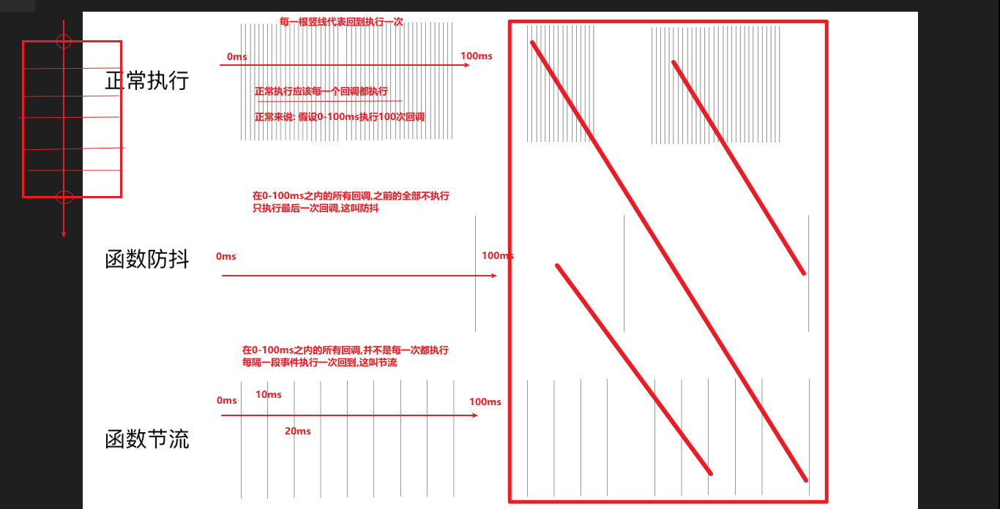


防抖原理

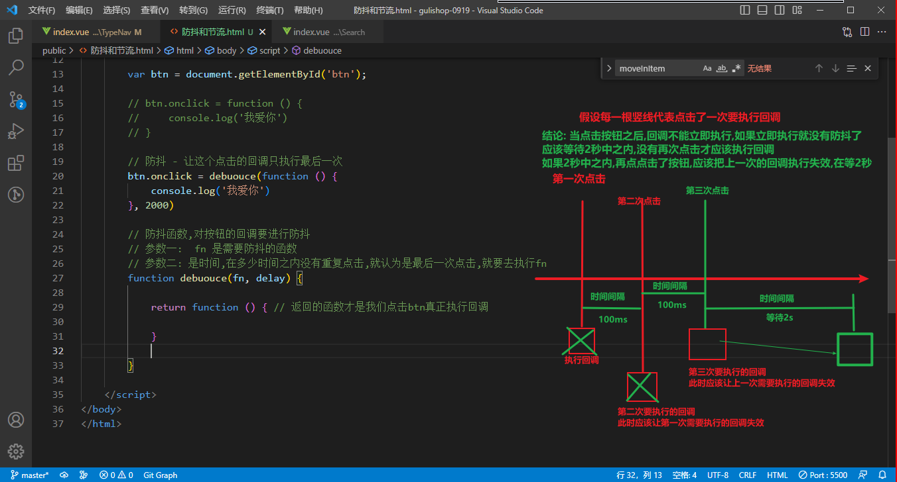


节流原理

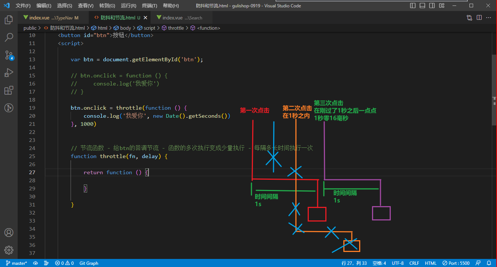


```js
// 防抖
function debounce(fn, delay) {
    var timer = null; // 用来存定时器
    return function () {
        if (timer) {
            clearTimeout(timer)
        }
        timer = setTimeout(fn, delay)
    }
}


// 节流
function throttle (fn, delay) {
    var flag = true; // 默认进来这个值是true
    return function () {
        if (flag) { // 默认设置定时器
            setTimeout(function () {
                fn();
                flag = true;
            }, 1000)
            flag = false;
        }
    }
}
```


#### 给每个item的鼠标移入加节流

使用的 lodash 进行节流的

```js
import { throttle } from 'lodash'

methods: {
    ...,
    moveIn: throttle(function(index) {
        this.currentIndex = index;
    }, 50, { 'trailing': false }),
}
```

lodash 设置 throttle，传递三个参数

```js
// 参数一: 需要节流的函数
// 参数二: 节流的时间
// 参数三: 配置项
//        leading:  节流开始之前执行
//        trailing: 节流结束之后执行
_.throttle(renewToken, 300000, { 'trailing': false })
```

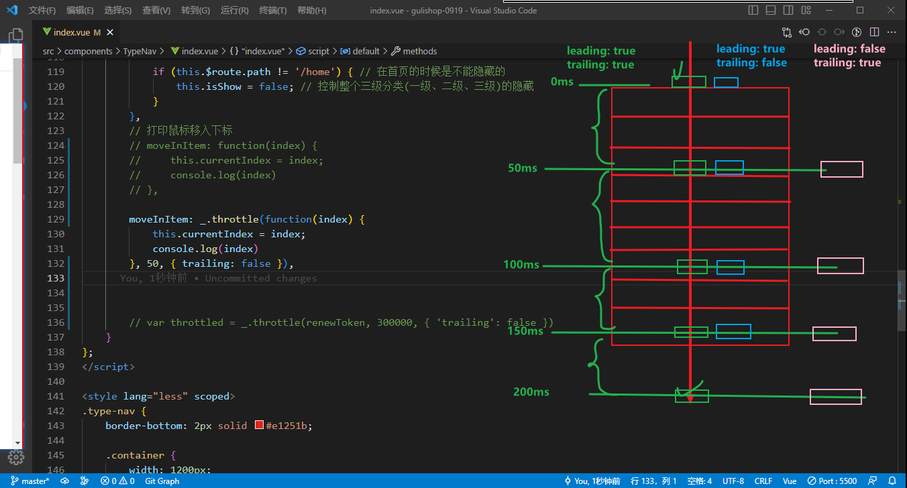


#### TypeNav 过渡效果

1. 将过渡的元素放到 transition 标签中
2. 书写类名 v-enter、v-enter-to、v-enter-active
3. 如果有多个过渡效果，给transition标签加name属性，类名 v- 开头变成  name- 开都

> 注意类名的权重

#### TypeNav 携带参数跳转

点击一级分类:  /search?category1Id=2&categoryName=手机

点击二级分类:  /search?category2Id=13&categoryName=手机通讯

点击三级分类:  /search?category3Id=61&categoryName=手机

跳转方式3种类:

1. router-link 声明式导航跳转

   性能不好,router-link是组件,本质在页面中使用的时候是new了一个实例,我们这里通过v-for循环出来的router-link有多少个?集具体没数过,就很多,有上百个

   相当于在内存中new了上百个组件吧,组件在不断的切换显示隐藏,造成了卡顿

2. $router.push 编程式导航跳转

   不是最优解,也有性能问题,比router-link强点,

   问题是,a标签循环渲染了上百个,他们绑定的回调也是上百个

   这上百个回调函数也要占内存

3. 事件委派

   给每个点击的元素设置属性 data-category1Id、data-category2Id、data-category3Id 和 data-categoryName

   通过事件冒泡,事件会传递到共同的父元素上

   给父元素绑定事件,通过e.target拿到点击的元素,取出参数来进行跳转传递

   使用 编程式导航进行跳转

> 注意:
>
> 给标签绑定 data-属性使用   `元素.dataset`   去取绑定的属性值
>
> 取的时候,拿到的属性是小写的,转成小写是 dataset 方式的特性


#### TypaNav参数丢失问题

有哪些地方可以进入search页面? 两个入口

1. 点三级分类参数携带 -> 通过query携带参数到search页面(完成)
2. 点击搜索按钮参数携带 -> Header组件当中,点击搜索,通过params携带参数到search页面即可

存在的问题:

1. 先点击三级分类,参数query携带到search页面了,再点击搜索按钮,丢失掉了query参数

   解决: 点击三级分类没啥问题,点击搜索按钮的时候,查看当前路由是不是有query参数,如果有携带上这个参数即可

2. 先点击搜索携带params参数到search页面,再点击三级分类,丢失掉paramas参数

   解决: 点击搜索按钮没啥问题,点击三级分类的时候,查看当前路由是不是有params参数,如果有携带上这个参数即可


#### TypeNav - 切换 home、search 页面重复发请求问题

把请求放到App.vue组件当中，把请求放到一个不会被销毁的组件中即可

至此为止TypeNav结束


### Mock

作用：拦截 ajax 请求，模拟随机数据

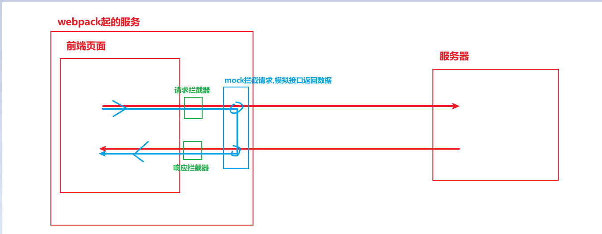

步骤：

1. 下载安装

   `npm i mockjs`

2. 引入使用

   `src/mock/index.js`

   ```js
   import Mock from 'mockjs'
   
   Mock.mock('/mock/userinfo', function () {
       return {
           code: 20000,
           data: '数据',
           message: 'success'
       }
   })
   ```

3. 在main.js中引入mock文件

4. 测试mock接口


# day04

### mock ListContainer和Floor 数据

使用mock把，ListContainer和Floor组件的数据加载进来

```js
Mock.mock('/mock/getBannerList', function() {
    return {
        code: 200,
        data: bannerData,
        message: 'success'
    }
})

Mock.mock('/mock/getFloorList', function() {
    return {
        code: 200,
        data: floorData,
        message: 'success'
    }
})
```

请求mock接口专门使用一个mocRrequest.js封装一个axios

书写api请求函数

三连环调用api将数据存到store当中

展示页面

### Swiper 使用

1. 安装

   npm i swiper@6

2. 引入文件

   ```js
   import Swiper from 'swiper/swiper-bundle.min.js'
   import 'swiper/swiper-bundle.min.css'
   ```

3. 准备DOM结构(已存在)

4. 创建swiper实例

   注意: 创建swiper的时候一定要到DOM完全加载完毕才能创建

   * setTimeout -> 不行

     等数据回来页面更新，请求的时候，数据不知道多长时间能响应回来，所以不能使用定时器

   * 在updated创建实例 -> 不行

     当页面中有其他数据的时候，其他数据更新的时候也会走updated，重复创建实例了

   * watch + $nextTick

     watch是在监听数据，当数据回来之后DOM并没更新呢，使用  $nextTick 等带DOM更新完毕之后，再创建swiper实例

   此时，ListContainer组件的轮播就展示出来，问题来了floor组件也要展示轮播，怎么办？

   

### 封装Swiper组件

   把之前创建swiper实例的过程单独拿出来封装成了一个组件

   ```html
<template>
    <div class="swiper-container" ref="swiperRef" id="mySwiper">
        <div class="swiper-wrapper">
            <div
                class="swiper-slide"
                v-for="(banner, index) in list"
                :key="banner.id"
            >
                
            </div>
        </div>
        <!-- 如果需要分页器 -->
        <div class="swiper-pagination"></div>

        <!-- 如果需要导航按钮 -->
        <div class="swiper-button-prev"></div>
        <div class="swiper-button-next"></div>
    </div>
</template>

<script>
import Swiper from 'swiper/swiper-bundle.min.js'
import 'swiper/swiper-bundle.min.css'
export default {
    name: "SwiperList",
    props: {
        list: {
            required: true
        },
        options: {
            type: Object,
            default: () => ({
                // autoplay: true, // 自动播放
                autoplay: {
                    pauseOnMouseEnter: true, // 鼠标移入暂停自动播放
                    disableOnInteraction: false, // 用户操作swiper之后，是否禁止autoplay。默认为true：停止。
                },

                loop: true, // 循环模式选项
                
                // 如果需要分页器
                pagination: {
                    el: '.swiper-pagination',
                },
                
                // 如果需要前进后退按钮
                navigation: {
                    nextEl: '.swiper-button-next',
                    prevEl: '.swiper-button-prev',
                },
            })
        }
    },
    data() {
        return {
            mySwiper: null // 存创建出来的swiper实例
        }
    },
    watch: {
        list: {
            handler(nval, oval) {
                if (nval && nval.length) {
                    // 等待DOM更新
                    this.$nextTick(() => {
                        this.initSwiper();
                    })
                }
            },
            // 这里必须加 immediate: true 配置,进来初始化当前组件的时候默认执行一次
            // 如果不配置这个选项,初始化的时候就不执行watch,数据发生变化的时候才会执行
            // 当前组件在哪用了? 两个地方
            // ListContainer 组件
            //      ListContainer当中的数据在进入SwiperList的时候是异步的,先请求数据在传入当前组件的
            // Floor 组件
            //      Floor组件是根据数据渲染出来的,然后Floor组件中的数据必然存在,
            //      不存在的话floor组件没法渲染出来
            //      此时进入当前组件的数据,一定是先有的数据,后创建的当前组件
            //      此时进来初始化当前组件的时候就已经有list数据了,如果不加 immediate: true ,后续数据不会发生变化,监听不到
            immediate: true,
            deep: true
        }
    },
    methods: {
        initSwiper() {
            // this.bannerSwiper = new Swiper ('.swiper-container', {
            // 创建实例的时候,可以放选择器,也可以放一个真实的DOM元素
            this.mySwiper = new Swiper(this.$refs.swiperRef, this.options)
        }
    }
}
</script>

<style scoped>

</style>
   ```

   > 注意：
   >
   > 需要传的参数有，渲染轮播图的数据，轮播图的配置项
   >
   > * 数据 - 监视数据的时候要考虑数据是同步进来组件的还是异步进来组件的，ListContainer数据就是异步进来的(先有组件，后有数据)，Floor的数据就是同步进来的(先有数据，后又组件)，需要给监视的数据加 `immediate: true`
   > * 轮播图的配置项 - 配置项去官网找

   

### Floor - 轮播展示

   直接拿封装好的SwiperList组件去渲染即可

   

   至此为止，首页结束

   

### Search 页面

   * 拆分组件
   * 初始化数据
     * 查看接口文档，书写api函数
     * 调用api三连环
     * mounted触发actions发请求拿数据，映射到页面中展示
   * 交互


# day05

   #### vuex 命名空间

   再模块化的基础上，配置`namespaced: true`开启命名空间，开启命名空间之后store中每个模块中的内容都独立了，包括 state、mutations、actions、getters 这些都独立了

   开启命名空间的意义所在：

   防止命名冲突，例如：A模块中有一个fn，B模块中也有一个fn，此时就命名冲突了

   开启命名空间之后，除了 state 调用方式和之前模块化的时候一样，其他的调用方式都变了

   ##### count 案例 - vuex命名空间

   ```js
store/index.js

import search from './modules/search.js'

export default new Vuex.Store({
    modules: {
        home,
        search // --> 开启命名空间
    }
})


store/modules/search.js
这个文件之前的写法都没变，唯独往外暴露的时候，加了 `namespaced: true`

export default {
    namespaced: true, // ----> 开启命名空间
    state,
    mutations,
    actions,
    getters
}
   ```

   调用:

   ```js
state调用
基本使用:
	this.$store.state.search.count
辅助函数:
	...mapState({
        count: state => state.search.count
    })

getters
基本使用:
	this.$store.getters['search/twoCount']
辅助函数
	参数一: 命名空间的名称,这个名称是模块化 modules 中配置决定的
 	参数二: 数组，数组中放该命名空间下计算出来的属性   
	...mapGetters('search', ['twoCount'])
	调用:
	this.twoCount

actions
基本使用
	this.$store.dispatch('search/increment')
辅助函数
	...mapActions('search', ['increment'])
	调用:
	this.increment()


mutations
基本使用
	this.$store.commit('ADD')
辅助函数
	...mapMutaions('search', ['ADD'])
	调用:
	this.ADD()
   ```

   

   命名空间讲完之后，把search页面的三连环搞定了，现在数据在store中

   

   

## 

### Search 页面交互

   1. 三级分类

      * 组装数据，发送请求

        数据从路由中来的，监视当前路由的改变，当路由发生改变的时候拿到query参数，

        放到请求参数 searchParams 中，调用 actions 发送请求

      * 面包屑交互

        面包屑的展示 从 `searchParams.category1Id` `searchParams.category2Id` `searchParams.category3Id` `searchParams.categoryName`当中拿数据进行展示，删除的时候重新跳转路由到当前页面，可以在watch中监听到，重新组装数据发请求渲染

   2. 搜索框

      * 组装数据，发送请求

        数据从路由中来的，监视当前路由的改变，当路由发生改变的时候拿到 params 参数，

        放到请求参数 searchParams 中，调用 actions 发送请求

      * 面包屑交互

        面包屑的展示 从 `searchParams.keyword` 当中拿数据进行展示，删除的时候重新跳转路由到当前页面，可以在watch中监听到，重新组装数据发请求渲染

   3. 品牌 - 品牌在单独的搜索器组件当中

      * 组装数据，发送请求

        在组件当中点击某一个品牌，把参数传给父组件，这里用的父子组件通信-自定义事件

        父组件在自定义事件的回调中得到参数，组装数据，发送请求

        > 自定义事件
        >
        > 1. 事件类型 - <myComp  @abc="abcHandler">
        > 2. 触发机制 - 自己触发  $emit 触发这个 abc 事件
        >
        > 如果想要自定义事件变成原生事件，加一个修饰符 .native ，它会把事件绑定在子组件的根标签上  例如: <myComp  @click.native="clickHandler">
        >
        > 参数:
        >
        > 在模板中，书写methods方法的时候，例如
        >
        > ```html
        > 1. <button @click='clickHandler'></button>
        > 2. <button @click='clickHandler(true)'></button>
        > 3. <button @click='clickHandler($event, true)'></button>
        > methods: {
        > 	clickHandler(e) {
        > 		1. 当 clickHandler 没有加小括号的时候 e是 事件对象
        > 		2. 当 clickHandler 加小括号的时候 e是参数
        > 		3. 当 clickHandler 加小括号且希望有事件对象的时候 在模板中使用 $event
        > 	}
        > }
        > 
        > 
        > 1. <myComp @abc='abcHandler'></myComp>
        > 2. <myComp @abc='abcHandler(true)'></myComp>
        > 3. <myComp @abc='abcHandler($event, true)'></myComp>
        > methods: {
        > 	abcHandler(e) {
        > 		1. 这个e是触发自定义事件时候传递的参数
        > 			例如: $emit('abc', true)  此时的e就是true
        > 		2. 加小括号传参数 true 的时候,这个e就是参数 true
        > 		3. 这里的 $event 是子组件触发时候传递的参数,例如:
        > 			$emit('abc', 'i love you')
        > 	}
        > }
        > ```

      * 面包屑交互

        拿 `searchmarams.trademark` (值是 '1:小米' )在模板中展示面包屑，通过split分割一下拿到'小米'文本，进行展示

        删除的时候也是组装数据，发送请求(把`searchmarams.trademark`置为空，发送请求)

   4. 平台属性  -  ['106:安装手机:手机一级']

      * 组装数据，发送请求

        在组件当中点击某一个平台属性，把参数传给父组件，这里用的父子组件通信-自定义事件

        父组件需要接收平台属性（拿ID和Name）和平台属性值（拿attrValue）

      * 面包屑交互

        组装数据，发送请求

   5. 优化

      1. 发送请求之前把空字段的干掉

         目的:减小发送请求的包的体积(给服务器省的)

         现在不好整,如果在调用发请求之前添加代码把空串的字段都删除掉,需要改的地方太多了

         就是 this.getSearchInfo(this.searchParams); 调用这行代码之前加其他代码,每个调用之前都加改的太多了

         调用actions的方法变了,加一层函数即可,在这层函数中加自己的逻辑

      2. 从home跳转到search页有历史记录，从search页内部跳转没有历史记录

         1. 需要把 删除 三级分类 和 删除 搜索框 的历史记录改成 replace

         2. 需要把 Header 组件中 搜索按钮跳转,根据来源保存历史记录

            从首页来的执行跳转的,保存(push),从搜索页来执行跳转的,不保存(replace)

         3. 需要把 TypeNav 组件中 三级分类点击跳转,根据来源保存历史记录

            从首页来的执行跳转的,保存(push),从搜索页来执行跳转的,不保存(replace)

   6. 排序

      参数:

      searchParams.order  -->  '1: desc'  (默认参数)

      1 综合  2 价格       desc 降序    asc 升序

      ```js
      orderParams(type) {
          // 组装数据
          let text = ''; // 存组装数据的结果
          // orderType 排序类型   1     2
          // orderRank 排序方式   desc  asc
          let [orderType, orderRank] = this.searchParams.order.split(':');
          // 点击同一个
          if (type == orderType) {
              if (orderRank == 'desc') {
                  text = `${ type }:asc`
              } else {
                  text = `${ type }:desc`
              }
          } else { // 点击不同的,只要点击不同的,默认展示降序
              text = `${ type }:desc`
          }
          this.searchParams.order = text;
          // 发送请求
          this.getSearchInfo();
      }
      ```

      排序的展示

      使用iconfont展示，需要考虑 高亮 和 箭头显示，计算属性优化了模板中使用 数据的时候写的太长

      

      

### 分页

    1. 组件的拆分 - 定义、注册(全局注册)、使用
     2. 初始化数据展示
     3. 交互


# day06

#### 分页 - 初始化数据

分析需要哪些数据：

* 当前页
* 每页条数 - 计算总页数 = 向上取整(总条数 / 每页条数)
* 总条数
* 连续数 - 要连续显示几个按钮(必须是一个奇数)

计算总页数

计算开始页码、和结束页码

 ```js
特殊情况 - 连续数大于总页码的时候
	start = 1
	end = pageToal
否则 - 正常计算
	start = pageNo - (连续数 - 1) / 2
	end = pageNo + (连续数 - 1) / 2
 ```


#### 分页交互

\3. 交互

 3.1 上一页、下一页(这两个写完之后,再进行下一步)

 3.2 中间连续数的每个点击,切换页面

   做这个的时候把页码假设为中间的一个数

​     把 searchParams.pageNo 设置成一个 中间的数,别整个边界值

 3.3 点击切换页面

   往页码为1的位置开始切换

​     切换的时候看什么时候隐藏 ... 和 1

   往页码为 "总页码" 的位置开始切换

​     切换的时候看什么时候隐藏 ... 和 pageTotal

 3.4  1 和 pageTotal 都可以点击,加上点击事件

 3.5 上一页、下一页禁用状态

 3.6 高亮

 3.7 切换页码的自定义事件,需要判断是不是当前页


#### bug - 当其他参数发生改变的时候,跳转第一页

使用一个值记录 recordPage ，当每次翻页完成的时候记录当前的页码

当下一次操作页面的时候，如果是翻页，searchParams.PageNo 发生改变，此时和 recordPage 不相等，证明是翻页

如果是其他参数该百年，此时  searchParams.PageNo 和 recordPage 相等，证明是其他参数改变，

此时给页码重置为1


search页码至此为止结束

### detail

1. 静态页面展示 - 定义(粘贴组件过来的)、注册(路由中)、使用

2. 初始化数据展示

   发请求，拿数据，此时需要当前商品的id，商品的id通过路由传递过来，拿到`skuId(商品id)`发请求

   api函数的封装

   三连环

   把数据映射到组件中展示: 展示面包屑、放大镜图片、小图列表、商品信息、销售属性

3. 交互

   * 销售属性 - 排他思想(只有交互，没有实际意义)

   * 放大镜交互

     1. 获取鼠标的实时位置，减去mask蒙层宽高的一般，得到蒙层实时的位置，赋值给蒙层就能跟随鼠标移动

     2. 判断边界条件 - 以水平方向为例

        左侧不能小于0，如若小于0赋值为0

        右侧不能大于(容器宽度 - 蒙层宽度)，如果大于的，赋值这个最大值

     3. 小图和大图的关系   -2倍  让大图页跟随变化

   * 小图列表

     使用 swiper 来展示，swiperList公用组件需要修改才能让图片列表使用

     给 swiperList公用组件 加一个插槽

   * 点击小图大图要修改

     兄弟组件间的通信 - 总线

     1. 安装总线
     2. 接收数据 - 绑定事件，留下回调
     3. 发送数据 - 触发事件，发送参数

     点击小图的时候告诉放大镜我们点的是第几张图片

   * 加入购物车

     加减按钮限制数量 - 不能小于1

     输入input框限制数量 - 字符串、小数、负数

     点击"加入购物车"按钮调接口，发请求，携带商品ID和商品数量

     > 加入购物车接口成功之后没有返回的数据，返回了null
     >
     > 在store当中如何让组件知道已经调用成功了?
     >
     > 强调async、await的使用
     >
     > async函数规则
     >
     > async函数返回一个promise，这个promise由return的返回值决定
     >
     > 1. 返回一个非promise值，async函数的promise一定是成功的
     >
     > 2. 返回一个promise值
     >
     >    返回成功的promise，async函数的promise就是成功的
     >
     >    返回失败的promise，async函数的promise就是失败的
     >
     >    返回pending的promise，async函数的promise就是pending的
     >
     > 3. 抛出错误，async函数的promise是失败的
     >
     > await规则
     >
     > await必须放在async函数中
     >
     > 1. 跟一个普通值，就是这个普通值
     > 2. 跟一个成功的promise，结果是成功promise的值
     > 3. 跟一个失败的promise，抛错 - 因为这里要报错，所以要使用 try...catch
     >
     > -----------
     >
     > 在store当中的 async 修饰的actions函数如果接口调用成功返回一个 普通值，此时外部接收到了
     >
     > ```js
     > store/modules/cart.js
     > const actions = {
     >     async setAddCart ({ commit }, { skuId, skuNum }) {
     >         try {
     >             let result = await reqToCart(skuId, skuNum);
     >             console.log(result);
     >             if (result && result.code == 200) {
     >                 return 'ok'
     >             }
     >             return Promise.reject('参数错误', result.data);
     >         } catch (error) {
     >             return Promise.reject(error)
     >         }
     >     }
     > }
     > detail组件
     > async addShopCart() {
     >     try {
     >     	await this.$store.dispatch('cart/setAddCart', params)
     >     	alert('添加购物车成功,即将跳转添加购物车成功页面');
     > 
     >     	sessionStorage.setItem('SKUINFO', JSON.stringify(this.skuInfo))
     >     	this.$router.push(`/addCartSuccess/${ this.skuNum }`);
     > 
     > 	} catch (error) {
     >     	console.error(error)
     > 	} 
     > }
     > ```
     >
     > 


# day07

#### detai添加购物车交互

### 添加购物车成功页面

1. 静态页面展示 - 定义、注册(路由注册,注册的时候需要接收params参数,接商品数量)、使用(点击"添加购物车"调用接口成功之后，跳转到该页面)

2. 初始化数据展示

   商品数量 - 路由的params参数

   商品信息 - sessionStroage

   > 拓展了解：cookie、session、token、JWT token
   >
   > 1. cookie
   >
   >    状态保持(校验用户身份)
   >
   >    	当登录的时候,后端给返回一个cookie存到浏览器当中,在次发请求的时候请求头会自动携带这个cookie
   >    	用来校验用户身份做状态保持的,为什么需要做状态保持?
   >    	因为HTTP请求是无状态请求
   >
   >    可以存储数据 - 通过 document.cookie 来保存和读取数据,存储4K左右的数据,每个域名下只能存储50个cookie,可以设置过期时间
   >
   > 2. session
   >
   >    session是一个服务端的技术,和浏览器没关系
   >    为什么会由session这个技术?因为cookie不安全,所以诞生了session
   >
   >    当登录的时候,后端校验用户成功之后,会在服务器生成一个session ID,通过响应头设置cookie,把这个sessionID带回浏览器
   >    当再次发送请求的时候,携带者这个cookie(存的是sessionID)发送到服务器,
   >    服务器接收到请求之后,拿着这个sessionID 去 session这个容器中对比,可以识别出你的身份
   >    session相当于是给cookie做了一个补充
   >
   > 3. token
   >        后来再发生出现了token(令牌)
   >        当登录的时候,后端校验完用户名密码之后,生成一个token,通过加密算法生成的,例如 base64 SHA256 等一些列加密方式
   >        生成之后返回给前端,当再次发送请求的时候,请求头携带token到服务器
   >        服务器解密可以知道你是谁
   >
   >    1. 跨域,token是允许跨域的
   >    2. token不需要再服务器创建容器,直接拿着令牌进行解密即可
   >       session在服务器要创建容器的,服务器有可能是集群,集群需要涉及到这个session容器内容的信息同步问题
   >
   > 4. JWT Token
   >
   >    简单理解,就是token加密更复杂了
   >
   >    由三部分组成 头部(header)、有效载荷(payload)、签名(signature)
   >    xxxxxxxxx.xxxxxxxxxx.xxxxxxxxx
   >
   >    ​     主要是用来做 多点登录的(PC、pad、phone同时登录就叫多点登录)

3. 交互

   查看商品详情

   去购物车结算


### 购物车

步骤: 

1. 静态页面显示 - 定义、注册、使用
2. 初始化数据展示
3. 交互

#### 初始化数据展示

调接口、三连环，发现没有数据返回，为什么没有数据？因为不知道谁买的什么商品，需要区分用户，这里添加一个用户的临时标识

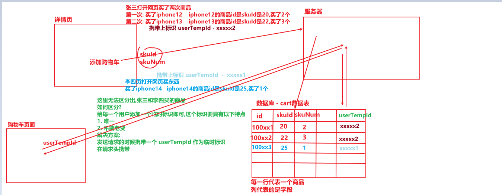

1. 获取(创建)用户临时标识

   在 `utils/userabout.js` 当中

   ```js
   import { v4 as uuidv4 } from 'uuid';
   
   // 标识特点:
   // 唯一 -> uuid
   // 不能老变 -> 从localStorage中去取,取到就用,取不到就创建
   
   // 获取用户临时标识的函数
   export const getUserTempId = () => {
       // 创建UUID的函数
       let userTempId = localStorage.getItem('USERTEMPID'); // 期望的是获取到uuid
   
       if (!userTempId) {
           userTempId = uuidv4();
           localStorage.setItem('USERTEMPID', userTempId)
       }
   
       return userTempId
   }
   ```

2. 将用户的临时标识存到store当中

   创建 store/modules/user.js 模块

   ```js
   import { getUserTempId } from "@/utils/userabout"
   
   const state = {
       // 刷新页面的时候store会重新初始化创建,在创建store的时候就把userTempId放到了store(内存)当中
       userTempId: getUserTempId(), 
   }
   const mutations = {}
   const actions = {}
   const getters = {}
   
   export default {
       namespaced: true,
       state,
       mutations,
       actions,
       getters,
   }
   ```

3. 在请求拦截器当中设置请求头

   ```js
   // 请求拦截
   request.interceptors.request.use((config) => {
       // 携带userTempId
       let userTempId = store.state.user.userTempId;
       if (userTempId) {
           // config.headers.userTempId --->  必须叫userTempId
           config.headers.userTempId = userTempId;
       }
       
       NProgress.start(); // 在请求开始的时候start
       return config
   }, (err) => {
       NProgress.done(); // 只要开始过之后,不管成功或失败,都应该结束掉
       return Promise.reject(err)
   })
   ```

> 有了用户的临时标识之后，在添加购物车的时候，就可以区分出是谁添加的，请求购物车列表的时候就可以拿到数据了

直接展示 - 循环数据，直接展示商品信息

简介展示 - 需要自己手动计算

* 全选 - every
* 总商品数 - reduce
* 总价 - reduce


# day08

 交互
        1. 每个商品的选中状态
                2. 每个商品数量的修改  --  放一放
                3. 每个商品的删除
                        4. 全选(商品选中状态批量修改)
                            5. 删除已选中(商品选中状态批量删除)


### 注册

1. 静态页面展示

2. 初始化数据展示(没有)

3. 交互

   收集表单数据，发请求、调接口

> 注意：验证码逻辑


​	


### 登录 ***

1. 静态页面展示

2. 初始化数据展示（没有）

3. 交互

   收集表单数据，点击登录，调用接口提交数据

调用接口，发送请求，返回一个Token，把Token存在Store中，用来识别用户身份，此时应该跳转至首页，首页要显示用户信息，登录接口并没有获取，拿着Token去获取用户信息

#### 获取用户信息

将store当中存的Token取出来，放到请求头当中，去调用获取用户信息的接口，那么此时就可以获取到用户信息了，获取到用户信息需要把用户信息存到store当中

问：什么时候获取用户信息?

在路由跳转的时候获取用户信息

#### 路由守卫

在路由切换的时候可以拦截这个过程，分为**全局前置**、全局解析、全局后置、**路由独享**、组件内守卫(三个)

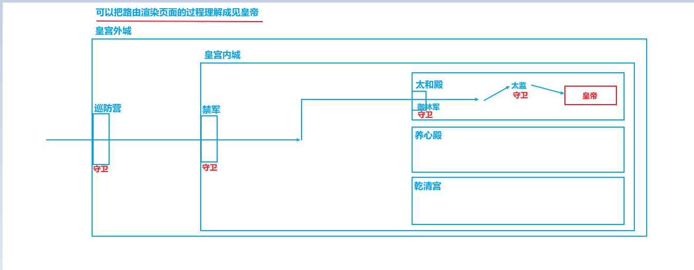

##### 执行过程:


这里比较重要的是 全局前置、路由独享，关于参数：

```js
router.beforeEach(function (to, from, next) {
    // to 去哪的路由对象
    // from 从拿来的路由对象
    // next 是否放行的函数
    //  next() 放行   next(false)不放行  next('/')去首页  next({ path: '/' }) 去首页
    next();
})
```


#### 路由跳转的过程中获取个人信息***

```js
// 当登录之后要跳转到首页，登录只获取token，不获取个人用户信息，个人用户信息在路由跳转的过程中获取
// 目前要往首页跳转，并且要拿个人信息
import store from '@/store'

router.beforeEach(async function (to, from, next) {
    const token = store.state.user.token; // 拿到登录存的token
    if (token) { // 如果有token就获取个人信息
        // 判断有没有个人用户信息
        let username = store.state.user.userinfo.name; // userinfo 这个userinfo是调用获取用户信息接口的时候,接口返回的数据存到store当中
        if (username) { // 证明store当中有个人信息,直接放行
            next();
        } else { // 证明store当中没有个人信息,此时有token
            // 获取用户信息
            try {
                await store.dispatch('user/getUserInfo'); // 触发actions获取用户信息
                next(); // 如果获取到了用户信息直接放行
            } catch (err) {
                // 如果走到catch中代表没有获取到用户信息,什么情况下会走到catch?
                // 1. 接口错误
                // 2. token过期
                // 此时是没有获取到个人信息但是要展示个人信息信息,需要登录
                // next('/login');
                // 直接跳登录页是死循环,重新走前置守卫,此时token有值,用户名没有,又去获取用户信息
                // 又获取不到,又进入catch,又跳转登录............
                
                // 那么怎么做?
                // 获取用户信息失败了,要么接口错误(概率很小),要么token过期,token已经过期了,获取不到用户信息了,清除调用,通过登录重新
                // 步骤:
                // 1. 清除token
                // 2. 跳转登录
                store.dispatch('user/clearToken');
                next('/login');
            }
        }
    } else {
        // 第一个进入页面的时候,一定是没有token的
        // 这里不能直接跳login,死循环了
        // next('/login');
        // 这里需要直接放行,项目当中有一些页面是不需要登录就可以让用户看到的,所以直接放行
        next();
    }
})
```

> 总结登录整体步骤：
>
> 1. 先点击登录按钮得到token，存到store当中
>
> 2. 准备好获取个人用户信息的一套逻辑，把token放到请求头当中，调用获取个人信息接口，返回数据，将个人信息存储到store当中
>
> 3. 在路由跳转的过程中获取用户信息
>
>    router.beforeEach(function(to, from, next) {
>
>    ​	// todo...
>
>    })


# day09

### 退出登录

调用接口,清除token(清除store当中、还有localStorage中)


点击结算跳转到结算页面、结算页面是需要登录的，如果没有登录不能让跳转到结算页面的，这里目前没有加限制，在所有的页面逻辑都写完了再加，需要加登录限制的页面不光结算一个页面，有结算、支付、个人中心这些页面都需要登录


#### 购物车登录和未登录逻辑

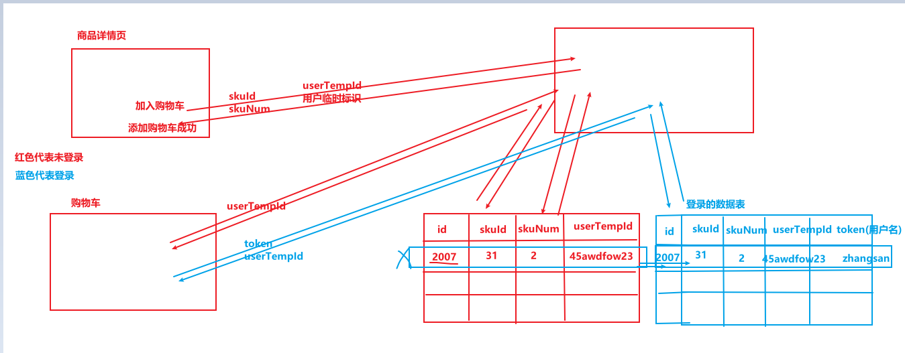


### 结算

1. 静态页面展示
2. 初始化数据展示
3. 交互

#### 静态页面展示

定义、注册(路由)、使用(点击 - 购物车页面点击结算跳转页面、展示)

#### 初始化数据展示

* 商品列表

  api、三连环、映射数据展示

  展示数据的时候分直接展示(直接展示商品列表)、间接展示(总商品数量和总金额)

* 地址信息

  api、三连环、映射数据展示

  这里地址信息在商品列表接口中是有数据的，但是由于我们没有修改地址信息的地方，防止使用同一个测试账号数据比较混乱，需要在其他账号登录的时候mock地址列表

#### 交互

地址列表的选择，下方“配送至”应该显示选择的地址，使用排他思想做

##### 提交订单

需要调用接口创建订单，然后跳转页面，从这个功能开始api函数不再走三连环，把api挂在了Vue的原型对象上

```js
import * as api from '@/api'
Vue.prototype.$api = api
```

调用接口的时候需要 组装数据 发送请求

###### 三种暴露方式

* 分别暴露

  ```js
  // 分别暴露
  export const a = 100;
  export fn = function() {}
  // 暴露出去是一个对象,对象的长什么样子?
  {
      a: 100,
      fn: function() {}
  }
  // 引入的时候
  import { a, fn } from 'xxx'
  import * as obj from 'xxx'
  obj.a
  obj.fn
  ```

* 统一暴露

  ```js
  // 统一暴露
  export {
      a: 200,
      fnc: function() {}
  }
  // 暴露出去是一个对象,对象的长什么样子?
  {
      a: 200,
      fnc: function() {}
  }
  // 引入的时候
  import { a, fnc } from 'xxx'
  import * as obj from 'xxx'
  obj.a
  obj.fnc
  ```

* 默认暴露

  ```js
  // 默认暴露
  export default {
      a: 300,
      func: function() {}
  }
  // 暴露出去一个对象,对象长什么样子?
  {
      default: {
          a: 300,
          func: function() {}
      }
  }
  // 引入的时候
  import { default } from 'xxx'; // 这个不对,不能这么,为什么?语法是没有问题的,default是一个关键字
  import { default as def } from 'xxx'
  import def from 'xxx' // 简写
  ```


当点击"提交订单"按钮的时候调用接口返回的数据是订单号，这个订单号需要通过路由的query参数携带到支付页面

### 支付

#### 静态页面展示

#### 初始化数据展示

从路由的query参数中拿到订单编号，调用api接口返回数据(这里没有走store，直接把数存到了当前组件)、展示 订单号、总金额


# day10

#### 交互

点击"立即支付"弹框一个二维码

* 二维码

  1. 安装qrcode(注意在GitHub搜索的时候搜索 node-qrcode)

     `npm i qrcode -S`

  2. 引入

     `import QRCode from 'qrcode'`

  3. 使用

     `await QRCode.toDataURL(text)`

* 弹框

  使用element-ui，有完整引入、按需引入

  完整引入

  ```js
  import Vue from 'vue'
  import ElementUI from 'element-ui';
  import 'element-ui/lib/theme-chalk/index.css';
  Vue.use(ElementUI);
  ```

  按需引入

  ```js
  import { MessageBox, Message, Button, Row } from 'element-ui'
  import 'element-ui/lib/theme-chalk/index.css';
  Vue.component(Button.name, Button); //  或 Vue.use(Button)
  Vue.component(Row.name, Row);
  
  Vue.prototype.$msgbox = MessageBox;
  Vue.prototype.$alert = MessageBox.alert;
  Vue.prototype.$confirm = MessageBox.confirm;
  Vue.prototype.$prompt = MessageBox.prompt;
  Vue.prototype.$message = Message;
  ```


支付的逻辑：

1. 点击"立即支付"，准备好二维码(二维码转的字符串是调用支付接口返回的一个支付的url)

2. 弹窗，显示二维码

   ```js
   this.$confirm(``, '使用微信支付', {
       dangerouslyUseHTMLString: true,
       cancelButtonText: '支付遇到问题', // 取消按钮
       confirmButtonText: '我已支付成功', // 确认按钮
       center: true, // 居中
       showClose: false, // 右上角关闭按钮是否显示,默认未true
       closeOnClickModal: false, // 点击遮罩是否关闭弹框(默认是true)
       closeOnPressEscape: false, // 点击ESC是否可以关闭弹框(默认是true)
       // function(action, instance, done)
       // action 的值为'confirm', 'cancel'或'close'
       // instance 为 MessageBox 实例，可以通过它访问实例上的属性和方法
       // done 用于关闭 MessageBox 实例(done是个函数)
       beforeClose: (action, instance, done) => {
           console.log(action);
           if (action == 'confirm') {
               // if (this.payStatus == 200) { // 支付成功,为什么要记录支付状态,就是为了拦截住,不弹框消失、跳走页面
               //     // 关闭弹窗
               //     done();
               //     // 清除定时器
               //     clearInterval(this.timer);
               //     // 跳转页面
               //     this.$router.push('/paySuccess')
               // }
   
               // 后门
               done();
               clearInterval(this.timer);
               this.$router.push('/paySuccess');
               
           } else if (action == 'cancel') {
               this.$message.warning(`请联系尚硅谷客服小姐姐 13366667777`);
               // 也需要清除定时器
               clearInterval(this.timer);
               done(); // 弹框消失
           }
       }
   })
   ```

3. 轮询(本质上就是一个定时器)

   使用 setInterval 调用"查询订单支付状态"接口，询问后端"那小子付钱没"，

   如果没有付钱，不做操作

   如果付钱需要，关闭弹窗、清除定时器、跳转页面

   在这里同时记录了一下支付状态，在弹窗"我已支付成功"按钮点击处拦截，如果没有支付成功是不能跳走的

   ```js
   if (!this.timer) {
       this.timer = setInterval(async () => {
           try {
               let result = await this.$api.reqPayStatus(this.orderId);
               if (result && result.code == 200) { // 200 代表支付成功  205 未支付(支付中)
                   // 跳走了
                   // 1. 隐藏弹框
                   this.$msgbox.close();
                   // 2. 清除定时器
                   clearInterval(this.timer);
                   // 3. 跳转页面
                   this.$router.push('/paySuccess');
                   // 4. 记录支付成功的状态
                   this.payStatus = 200;
               }                        
           } catch (error) {
               console.error(error);
           }
       }, 3000);
   }
   ```


> 关于定时器的补充：
>
> 1. 变量存储定时器的时候存的是定时器的编号，清除定时器的时候直接可以通过编号清除，一般不这么做，因为不知道页面中定时器有几个，编号是可变的
> 2. clearTimerout可以清除setInterval; clearInterval可以清除 setTimeout


支付成功之后跳转"支付成功"页面


## 

### 支付成功页面

* 继续购物 - 首页
* 查看订单 - 个人中心

#### 个人中心展示

使用二级路由组件，把myOrder和groupOrder拆分出来展示

##### myOrder

静态页面展示

初始化数据展示

交互 - 分页


#### $set

`this.$set(obj, 'age', 33)`

参数一: 目标对象
参数二: 属性
参数三: 属性值

作用: 给当前组件设置响应式数据，并且更新视图


### 如果没登录，访问 （交易相关、支付相关、用户中心相关）跳转到登录页面 

```js
// 需求1: 交易、支付、支付成功、个人中心必须登录才能访问,不能直接放行
// 创建一个黑名单,在黑名单数组中的页面必须登录
// 需求2: 跳转的页面在黑名单当中,此时跳转登录页,当登录成功之后,去到刚刚想去而没有去到的页面
//      例如:  /trade -> /login 当登录之后,还跳转到 /trade
```

登录后会自动跳转前面想去而没到的页面

全局守卫
		如果是跳转多个页面都要进行同一个检测，那么必然使用的是全局守卫（前置）


* 只有携带了skuNum和sessionStorage内部有skuInfo数据  才能看到添加购物车成功的界面

* 只有从购物车界面才能跳转到交易页面(/trade)（创建订单）

* 只有从交易页面（创建订单）页面才能跳转到支付页面

* 只有从支付页面才能跳转到支付成功页面


### 图片懒加载

图片懒加载特点说明

(1) 还没有加载得到目标图片时, 先显示loading图片

(2) 在 `` 进入可视范围才加载请求目标图片

使用步骤：

1. 下载安装

   `npm install vue-lazyload@1`

2. 引入并配置loading图片

   ```js
   import VueLazyload from 'vue-lazyload'
   import loading from '@/assets/images/loading.gif'
   // 在图片界面没有进入到可视范围前不加载, 在没有得到图片前先显示loading图片
   Vue.use(VueLazyload, { // 内部自定义了一个指令lazy
     loading,  // 指定未加载得到图片之前的loading图片
   })
   ```

3. 使用

   ``


> 我们一般不会把所有插件使用、组件注册都放在 main.js 中
>
> 插件一般放在 `src/plugin` 文件夹中
>
> 组件注册一般放在 `src/register`


### 路由懒加载(参考代码)

当打包构建应用时，JS包会变得非常大，影响页面加载。如果我们能把不同路由对应的组件分割成不同的代码块，然后当路由被访问的时候才加载对应组件，这样就更加高效了

本质就是Vue 的异步组件在路由组件上的应用

需要使用动态import语法, 也就是import()函数

```js
/* 
1. import('模块路径'): webpack会对被引入的模块单独打包
2. 路由函数只在第一次请求时才执行, 也就是第一次请求访问对应路由路径时才会请求后台加载对应的js打包文件
*/
const Home = () => import('@/pages/Home')
const Search = () => import('@/pages/Search')
const Detail = () => import('@/pages/Detail')
```

目的:

1. 进入哪个页面就加载哪个页面

2. 首次进入网站时,不需要加载所有的代码,文件体积变小,加载速度快

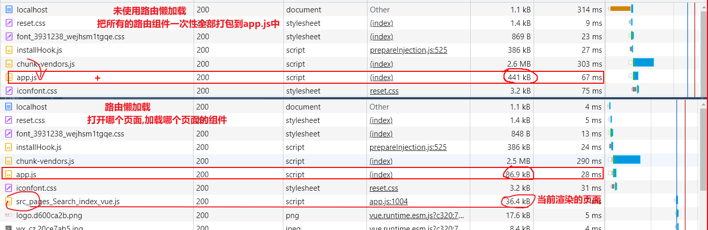

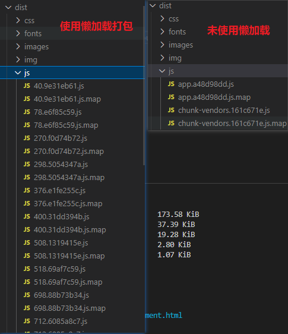


### 注册页表单校验 - vee-validate(参考文档)

(1) 项目中有一些如注册/登陆表单, 在提交请求前是需要进行表单输入数据校验的

(2) 只有前台表单验证成功才会发请求

(3) 如果校验失败, 以界面红色文本的形式提示, 而不是用alert的形式

(4) 校验的时机, 除了点击提交时, 还有输入过程中实时进行校验

##### 说明

vee-validate是专门用来做表单验证的vue插件
我们当前用的是2.x的版本,  最新的4.x版本适配vue3,  3.x版本使用比较麻烦
github地址:       https://github.com/logaretm/vee-validate
内置校验规则:   https://github.com/logaretm/vee-validate/tree/v2/src/rules
中文messages: https://github.com/logaretm/vee-validate/blob/v2/locale/zh_CN.js

##### 使用

1. 引入

   ```js
   下载: npm install -S vee-validate@2.2.15  
   
   引入插件:
   import Vue from 'vue'
   import VeeValidate from 'vee-validate'
   Vue.use(VeeValidate)
   ```

2. 基本使用

   ```js
   单独验证(注意: name必须指定,验证时需要的是哪个字段,参考的就是name值)
   <input v-model="mobile" name="phone" v-validate="{required: true,regex: /^1\d{10}$/}" 
       :class="{invalid: errors.has('phone')}">
   <span class="error-msg">{{ errors.first('phone') }}</span>
   
   整体验证  在点击完成注册的是由对所有的表单项进行验证
   const success = await this.$validator.validateAll() // 对所有表单项进行验证,验证通过返回true
   ```

3. 提示文本信息本地化

   ```js
   import VeeValidate from 'vee-validate'
   import zh_CN from 'vee-validate/dist/locale/zh_CN' // 引入中文message
   
   VeeValidate.Validator.localize('zh_CN', {
       messages: {
           ...zh_CN.messages,
           is: (field) => `${field}必须与密码相同`  // 修改内置规则的message
       },
       attributes: { // 给校验的field属性名映射中文名称
           phone: '手机号',
           code: '验证码',
       }
   })
   ```

   > 完整中文message源码:  https://github.com/logaretm/vee-validate/blob/v2/locale/zh_CN.js

4. 自定义验证规则

   ```js
   VeeValidate.Validator.extend('agree', {
       // 验证函数需要自己写,返回true代表验证通过,返回false代表没通过,value对应input输入框的值
       validate: value => {
           return value
       },
       // 获取错误信息,自定义的,field对应的是验证的字符
       getMessage: field => field + '必须同意'
   })
   ```


