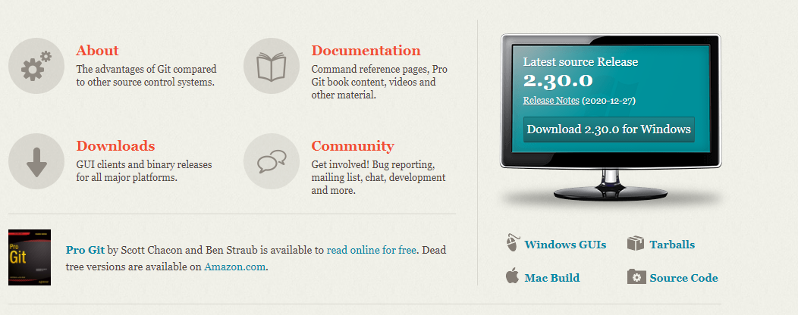
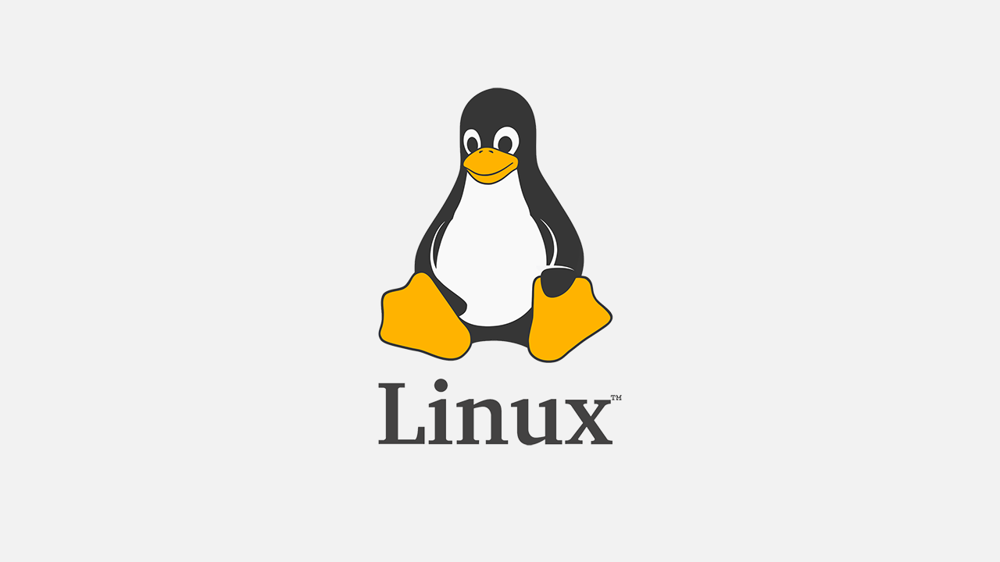
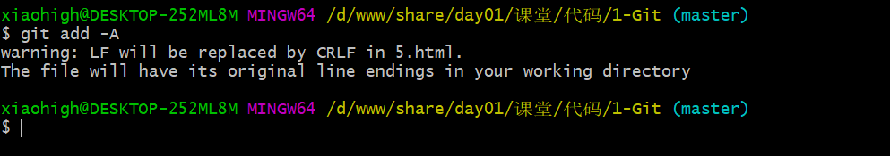
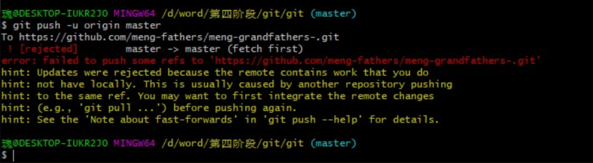
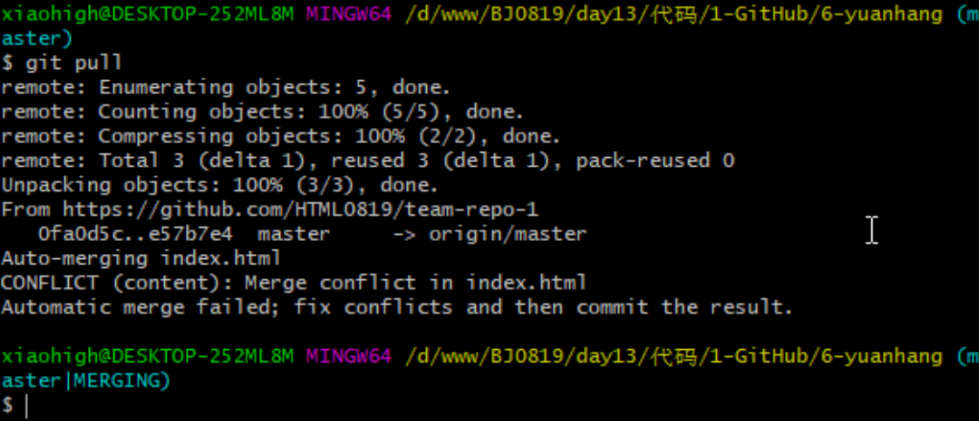
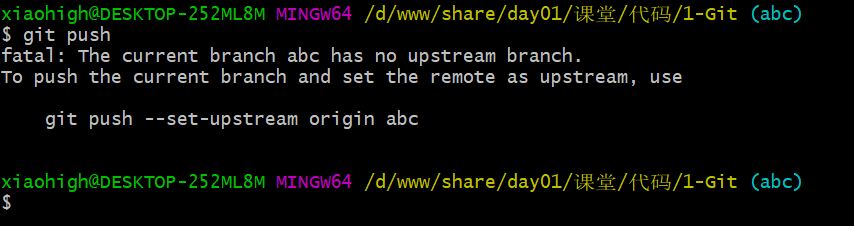
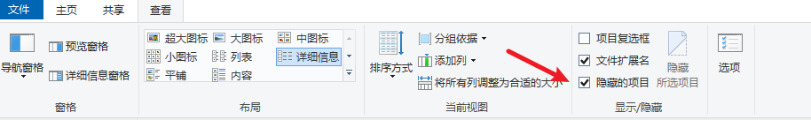

学习方法:

为什么？是什么？怎么玩？


接下来的课程:

git -> 版本控制工具

ES6 -> 新的 ECMAScript 规范

node -> 运行js的一个环境(浏览器)

ajax -> 发送网络请求

axios -> 对ajax的一个封装(和jquery一样是一个包)

gulp -> 打包工具(压缩、混淆)

webpack -> 打包工具


## Git 介绍

Git 是一款开源免费的版本控制系统，是一个应用程序


### Git 作用

版本控制系统在项目开发中作用重大，主要的功能有以下几点

- 代码备份
- 版本回退
- 协作开发
- 权限控制

### 下载安装

下载地址 <https://git-scm.com/> ，安装方式与 QQ 安装相同，一路下一步，中间可以设置软件的安装路径




## Linux 常用命令

Linux 是一套开源免费的操作系统，它与 Windows 属于同一类型的事物，但是操作方式却与 windows 不同。



Windows 为图形化操作形式，Linux 一般使用命令与系统进行交互，常用的命令有：

| 命令                                      | 介绍                                                         |
| ----------------------------------------- | ------------------------------------------------------------ |
| touch 文件名                              | 创建一个文件                                                 |
| mkdir 文件夹名称                          | 创建文件夹（make directory）                                 |
| <span style="color:red">ls</span>         | 查看文件夹下的文件 （list 单词的缩写）                       |
| <span style="color:red">cd</span>         | 改变工作目录，（change directory 缩写）                      |
| Tab                                       | 路径自动补全                                                 |
| clear                                     | 清屏（也可以使用 <span style="color:red">ctrl + l </span> 快捷键） |
| rm 文件名                                 | 删除文件或文件夹                                             |
| rm -rf 文件名                             | 强制删除(慎用)                                               |
| echo 文本 > 文件名                        | 文件写入文本                                                 |
| cat 文件名                                | 查看文件内容                                                 |
| <span style="color:red">ctrl + c</span>   | 取消命令                                                     |
| cp  文件名1  文件名2                      | 复制[文件名1]粘贴[文件名2]                                   |
| mv 文件名1 文件名2                        | [文件名1]重命名[文件名2]                                     |
| mv 文件名1 路径                           | [文件名1]移动到[路径]                                        |
| <span style="color:red">上下方向键</span> | 查看命令历史                                                 |


## Vim 基本使用

Vim 是一款命令行下的文本编辑器，编辑方式跟图形化编辑器不同


Vim 编辑文件的步骤：

1. 命令行 `vim 文件名` 打开文件

2. 按『i』进入编辑模式

3. 编辑文件内容

4. `ESC` + `:wq` 保存并退出   w: write   q: quit

   `ESC` + `:q!` 不保存并退出(强制退出)


```
vim 888.txt  ---> 使用vim编辑器打开888.txt文件,打开它的时候就变成编辑器模式,不在是终端模式
此时编辑器是处于[命令模式]
yy  命令模式下yy代表的是复制光标所在行
p   命令模式下p代表的是粘贴
dd  命令模式下dd代表的是删除光标所在行
按下 i / a / o 进入[输入模式],编辑器底部显示 INSERT 此时就可以编辑文本内容
按下 esc 退出输入模式,回到[命令模式]
按下: 此时处于[底线命令模式](底行模式)
输入
	:wq  ---> 保存并退出
	:q!  ---> 不保存退出(强制退出)
	:q   ---> 退出  --> 在你没有修改过文件的时候就可以用
	:w   ---> 保存  ---> 只是保存
```


## Git 使用

### 起始配置

第一次使用 Git 的时候，我们需要配置用户名和邮箱，记录开发者的信息

```shell
# 配置自己的姓名
git config --global user.name "Your Name" 
# 配置自己的邮箱
git config --global user.email "email@example.com" 
```

> 注意
>
> 1. 命令之间有空格
>2. 上面的两个命令只需要运行一次即可, 如果输入错误, 重新运行命令即可
> 3. 可以使用 `git config -l `命令来查看配置信息 (使用 <span style="color:red;font-weight: bold">q</span> 字母退出配置查看窗口)
>4. 这个命令以后不用自己手敲, 直接复制修改『名字』与『邮箱』即可


### 基本操作

Git 的起始操作包括以下几个步骤

1. 创建并进入空文件夹

2. 右键 -> 点击 Git Bash Here 启动命令行

3. 仓库初始化 (一个仓库只运行一次 git init)

   ```shell
   git init
   ```

4. 创建一个初始化文件 index.html

5. 将文件加入到暂存区

   ```shell
   git add index.html
   ```

6. 提交到仓库

   ```shell
   git commit -m  文字说明
   ```

> 初始化仓库之后,本地分为三个区域
>
> 工作区、暂存区、仓库区域

### <span style="color:red">版本库的三个区域</span>

* 工作区（代码编辑区）
* 暂存区（修改待提交区）
* 仓库区（代码保存区）


### 命令小结

| 命令                                                   | 作用                                       |
| ------------------------------------------------------ | ------------------------------------------ |
| <span style="color:red">git   status</span>            | 查看版本库状态                             |
| <span style="color:red">git   add   -A</span>          | 添加所有修改到暂存区                       |
| <span style="color:red">git   add   .</span>           | 添加所有修改到暂存区                       |
| <span style="color:red">git   commit   -m 注释 </span> | 建立存档并添加注释                         |
| git   restore   --staged   文件名                      | 将暂存区的文件返回到工作区(不常用)         |
| git   ls-files                                         | 查看暂存区文件                             |
| git   diff                                             | 查看工作区与暂存区的差异（不显示新增文件） |
| git   diff   --cached                                  | 查看暂存区与仓库的差异                     |


> nothing to commit, working tree clean
>
> ​	代表没有可以提交的内容,此时三个区处于同一状态
>
> 在 git bash 命令行当中可以通过颜色来区分当前处于什么状态
>
> 红色: 代表文件处于工作区       ---->  git add -A  --> git commit -m '文本'
>
> 绿色: 代表文件处于暂存区       ----->  git commit -m '文本'
>
>  
>
> git commit 两种使用方式
>
> git commit -m '文本'   直接添加描述信息，进行存档
>
> git commit 进入vim编辑器模式,输入描述信息,进行存档


```
在第一次使用git时候,要配置[用户名]和[邮箱],只配置一次  注意: 这两行命令不用记

正式使用:
1. git init
	初始化一个仓库,初始化的仓库在当前路径下,会创建一个隐藏文件夹 [.git]
	注意: 不要去修改这个文件夹中的东西, 不要仓库嵌套仓库
	这个命令只在初始化仓库的时候使用一次
	此时三个区域就已经存在了(工作区、暂存区、仓库区),这三个区域存的是一种状态
-----------------------------------------------------------
创建文件 index.html 
	在工作区创建了一个文件
git  add  .
	将工作区所有的内容添加到暂存区
git  commit -m '描述信息'
	将暂存区的所有内容添加到仓库区
	此时工作树清洁,三个区处于同一个状态
-----------------------------------------------------------
创建文件 app.js
	在工作区创建了一个文件
git add .
	将工作区所有的内容添加到暂存区
git restore --staged app.js
	将app.js从暂存区移除,返回到工作区
	注意: 这条指令只能在文件添加到暂存区使用
	此时 app.js 在工作区
git ls-files
	查看当前暂存区里面的文件列表,这只是看文件的列表,和添加工作区、添加暂存区没关系
	此时显示只有 index.html
git add .
	将工作区所有的内容添加到暂存区
git ls-files
	查看暂存区里面文件列表  index.html app.js
git commit -m '第二次修改'
	暂存区添加到仓库区
-----------------------------------------------------------
修改文件 index.html 内容
	此时工作区更新了内容
git diff
	查看工作区和暂存区的差异
git add .
	将工作区所有的内容添加到暂存区
git diff --cached
	查看暂存区和仓库区的差异


注意的点:
git status
	红色:  处于工作区
	绿色:  处于暂存区
git restore --staged app.js
	只能在工作区添加到暂存区之后使用
git diff
	这个文件一定是已存在的文件,如果是新建文件不好使
	对比差异的绿色代表新增内容
	对比差异的红色代表删除内容

```


### 版本回滚

Git 可以将项目代码内容切换到历史的任何一个版本

#### 查看历史记录

借助于下面命令，可以查看

```shell
git log
git log --oneline
```

> 如果内容偏多， 需要使用方向键上下滚动， 按 `q` 退出

#### 版本回滚   

```shell
git reset --hard  b815fd5a6ae655b521a31a9
```

> <span style="color:red">进行版本回退时，不需要使用完整的哈希字符串，前七位即可</span>
>
> <span style="color:red">版本切换之前，要对工作区内容进行提交  add commit </span>


#### 找不到版本号的情况

查看所有的操作记录

```sh
git reflog
```


### <span style="color:red">配置忽略文件</span>

项目开发过程中有些文件不应该存储到版本库中，这个时候配置忽略这些文件。常见情况有：

1. 临时文件   
2. 多媒体文件，如音频，视频
3. 可执行文件，如 exe 文件
4. 编辑器生成的配置文件  (.idea)  
5. npm 安装的第三方模块


Git 中需要创建一个文件 『.gitignore』 设置忽略，一般与 .git 目录同级，常用规则如下：

```sh
# 忽略所有的 .idea 文件夹
.idea
# 忽略所有以 .test 结尾的文件
*.test
# 忽略 node_modules 文件和文件夹
/node_modules
```


#### 仓库中已经提交该文件

1. 对于已经加入到版本库的文件，可以在版本库中删除该文件

    ```sh
    git rm --cached .idea
    ```

2. 然后在 .gitignore 中配置忽略

    ```sh
    .idea
    ```

3. add  和 commit 提交即可


### <span style="color:red">分支</span>

分支是 Git 重要的功能特性之一，开发人员可以在主开发线的基础上分离出新的开发线。

#### 基本操作

| 命令                 | 作用         |
| -------------------- | ------------ |
| git branch name      | 创建分支     |
| git branch           | 查看所有分支 |
| git checkout name    | 切换分支     |
| git merge name       | 合并分支     |
| git branch -d name   | 删除分支     |
| git checkout -b name | 创建并切换   |

> 注意:  <span style="color:red;font-weight:bold">每次在切换分支前 提交工作区的修改</span>


#### <span style="color:red">分支冲突</span>

当多个分支修改同一个文件后，合并分支的时候就会产生冲突，冲突的解决非常简单，『将内容修改为最终想要的结果』，步骤如下：

1. 定位产生冲突的文件 （git status   both modified 标识的文件为有冲突的文件）
2. 修改冲突文件的内容为最终正确的结果
3. git add -A  和 git commit 提交即可


## GitHub


### 介绍

[GitHub](https://github.com/) 是一个 Git 仓库管理网站。可以创建远程中心仓库，为多人合作开发提供便利。 

### 使用流程

GitHub 远程仓库使用流程较为简单，主要有以下几种场景：

#### <span style="color:red">本地有仓库</span>

1. 注册并激活账号

2. 创建仓库

3. 获取仓库的地址

4. 本地配置远程仓库的地址
  
   ```shell
   git remote add origin https://github.com/xiaohigh/test2.git  
   //远端仓库管理   列宁    弗拉基米尔·伊里奇·乌里扬诺夫   
   add  添加
   origin 远端仓库的别名
   https://github.com/xiaohigh/test2.git    仓库地址
   ```
   
5. 本地提交（确认代码已经提交到本地仓库）

6. 将本地仓库内容推送到远程仓库
  
   ```shell
   git push -u origin master
   //
   push 推送
   -u   关联, 加上以后,后续提交时可以直接使用 git push
   origin 远端仓库的别名
   master 本地仓库的分支
   ```


>git remote add origin https://gitee.com/newsegmentfault/project_0528_4.git
>
>git push -u origin "master"
>
>推代码第一次是需要输入用户名密码的,第二次开始就不需要了
>
> 
>
>git checkout .  工作区修改文件代码 回退到工作树清洁的状态(只能回退已存在文件内容)


#### <span style="color:red">本地没有仓库</span>

1. 注册并激活账号

3. 克隆仓库
  
   ```shell
   git clone https://github.com/xiaohigh/test2.git 
   ```
   
3. 增加和修改代码

4. 本地提交

   ```shell
   git add -A
   git commit -m 'message'
   ```

5. 推送到远程

   ```shell
   git push origin master
   ```

> 克隆代码之后， 本地仓库会默认有一个远程地址的配置， 名字为 origin


### <span style="color:red">多人合作</span>

##### 账号仓库配置

GitHub 团队协作开发也比较容易管理，可以创建一个组织

- 首页 -> 右上角 `+` 号-> new Organization
- 免费计划
- 填写组织名称和联系方式（不用使用中文名称）
- 邀请其他开发者进入组织（会有邮件邀请）

* 点击组织右侧的 settings 设置
* 左侧 Member privileges
* 右侧 Base permissions 设置 write 👌

##### 协作流程

第一次提交

1. 得到 Git 远程仓库的地址和账号密码

2. 将代码克隆到本地（地址换成自己的）

    ```shell
    git clone https://github.com/xiaohigh/test.git
    ```

3. 切换分支

    ```
    git checkout -b 新分支名
    ```

4. 开发代码

5. 本地提交

    ```shell
    git add -A
    git commit -m '注释内容'
    ```

6. 合并分支

    ```shell
    git checkout master
    git merge 新分支名
    ```

7. 更新本地代码

    ```shell
    git pull
    ```

8. 提交代码

    ```shell
    git push 
    ```

##### 工作流程

第 N 次流程

1. 更新代码

   ```
   git pull
   ```
   
2. 创建并切换分支

   ```
   git checkout -b 新分支名
   ```
   
3. 开发功能

4. 提交

   ```
   git add -A
   git commit -m '注释'
   ```

5. 合并分支

   ```
   git checkout master
   git merge 新分支名
   ```

6. 更新代码

   ```
   git pull
   ```

7. 推送代码

   ```
   git push
   ```

##### 冲突解决

同分支冲突一样的处理，将代码调整成最终的样式，提交代码即可。


### GitFlow

GitFlow 是团队开发的一种最佳实践，将代码划分为以下几个分支


- Master 主分支。上面只保存正式发布的版本
- Hotfix  线上代码 Bug 修复分支。开发完后需要合并回Master和Develop分支，同时在Master上打一个tag
- Feather 功能分支。当开发某个功能时，创建一个单独的分支，开发完毕后再合并到 dev 分支
- Release 分支。待发布分支，Release分支基于Develop分支创建，在这个Release分支上测试，修改Bug
- Develop 开发分支。开发者都在这个分支上提交代码


## 附录

### Git 官方书籍

[https://git-scm.com/book/zh/v2/](https://git-scm.com/book/zh/v2/起步-关于版本控制)

### .git 目录


* hooks 目录包含客户端或服务端的钩子脚本，在特定操作下自动执行
* info 信息文件夹. 包含一个全局性排除文件，可以配置文件忽略
* logs 保存日志信息
* objects <span style='color:red'>目录存储所有数据内容</span>,本地的版本库存放位置
* refs 目录存储指向数据的提交对象的指针（分支）
* config 文件包含项目特有的配置选项
* description 用来显示对仓库的描述信息
* HEAD 文件指示目前被检出的分支
* index 暂存区文件，是一个二进制文件  (git ls-files)

> 切记： <span style="color:red">不要手动去修改 .git 文件夹中的内容</span>

### CRLF

CRLF 是Carriage-Return Line-Feed 的缩写。

CR 表示的是 ASCII 码的第 13 个符号 \r 回车，LF 表示的是 ASCII 码表的第 10 个符号 \n 换行。

每个操作系统对回车换行的存储方式不同

* windows 下用 CRLF（\r\n）表示
* linux 和 unix 下用 LF（\n）表示
* mac 系统下用 CR（\r）表示


### 

### 常见错误

#### 回车换行转换问题



这个问题主要是 Git 在你提交时自动地把回车（CR）和换行（LF）转换成换行（LF），没有影响，<span style="color:red">这里建议大家保留这个状态</span>。可以通过下面的命令设置不转换，但是不推荐

```sh
git config --global core.autocrlf false // 不推荐
```

#### 提交报错



其他人已经提交过，本地代码需要更新，首先运行 `git pull` 命令

#### 冲突提醒



#### 提交错误



如果第一次将本地仓库分支提交到远程时，直接使用 `git push` 可能会报这个错误，解决方法

```sh
git push -u origin master
```

### 提交错误


当前所在文件夹不是一个 git 仓库目录，切换目录工作

### 找不到 .git 的方法



